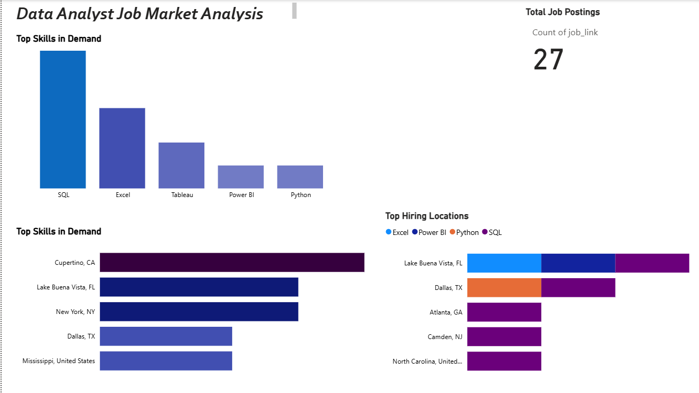

# 📊 Data Analyst Job Market Analysis (1.3M+ LinkedIn Jobs Dataset)

## 🔍 Overview
Analyzed LinkedIn job postings dataset (~1.3M+ records) to identify in-demand skills, hiring trends, and location-based opportunities.

## 🛠 Tools Used
- Python (Data Cleaning)
- SQL (Analysis)
- Power BI (Dashboard)

## 📊 Key Insights
- SQL appears in ~70–80% of job postings, making it a core skill
- Excel and Tableau remain essential for business reporting
- Cupertino & Lake Buena Vista show high hiring concentration
- Power BI & Python indicate shift toward modern analytics

## 📈 Dashboard Features
- Top Skills in Demand
- Top Hiring Locations
- Skill-wise Demand by Location
- Interactive Filters (Location, Company, Job Type)

## 📸 Dashboard Preview
  ****

## 💡 Business Impact
Helps job seekers focus on high-demand skills and locations to improve job opportunities.
